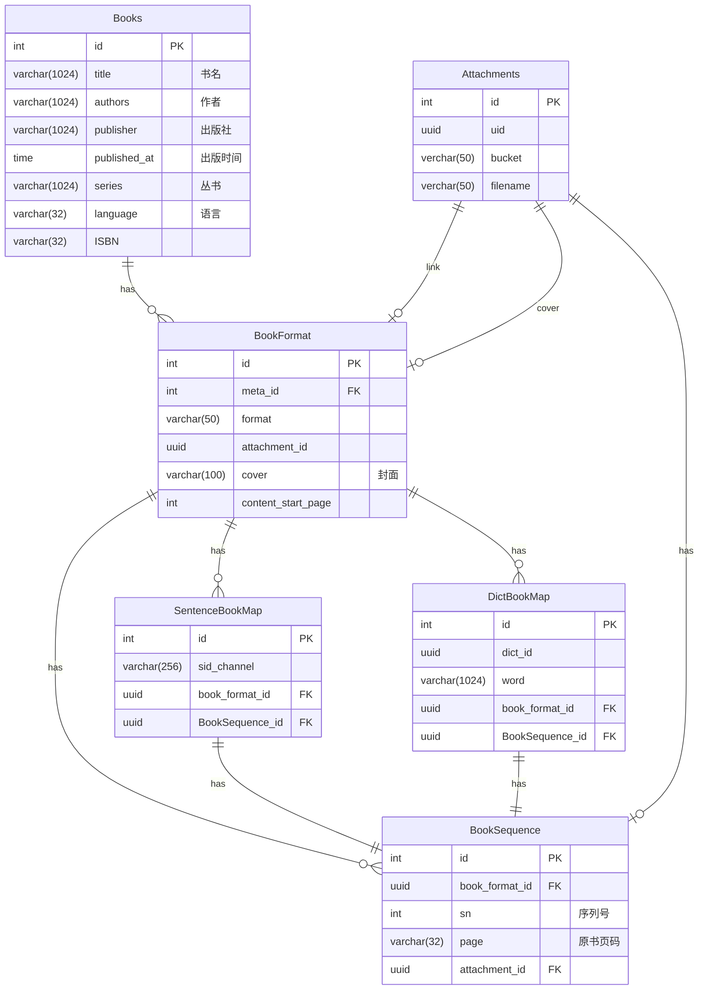

# aa

```mermaid
erDiagram
    Books ||--o{ BookFormat:"has"
    BookFormat ||--o{ BookSequence:"has"
    SentenceBookMap ||--|| BookSequence:"has"
    BookFormat ||--o{ SentenceBookMap:"has"
    DictBookMap ||--|| BookSequence:"has"
    BookFormat ||--o{ DictBookMap:"has"
    Attachments ||--o| BookFormat:"link"
    Attachments ||--o| BookFormat:"cover"
    Attachments ||--o| BookSequence:"has"
    BookFormat{
        int id PK
        int meta_id FK
        varchar(50) format
        uuid attachment_id
        varchar(100) cover "封面"
        int content_start_page
    }
    Books{
        int id PK
        varchar(1024) title "书名"
        varchar(1024) authors "作者"
        varchar(1024) publisher "出版社"
        time published_at "出版时间"
        varchar(1024) series "丛书"
        varchar(32) language "语言"
        varchar(32) ISBN
    }
    BookSequence{
        int id PK
        uuid book_format_id FK
        int sn "序列号"
        varchar(32) page "原书页码"
        uuid attachment_id FK
    }
    SentenceBookMap{
        int id PK
        varchar(256) sid_channel
        uuid book_format_id FK
        uuid BookSequence_id FK
    }
    DictBookMap{
        int id PK
        uuid dict_id
        varchar(1024) word
        uuid book_format_id FK
        uuid BookSequence_id FK
    }
    Attachments{
        int id PK
        uuid uid
        verchar(50) bucket
        verchar(50) filename
    }
```
