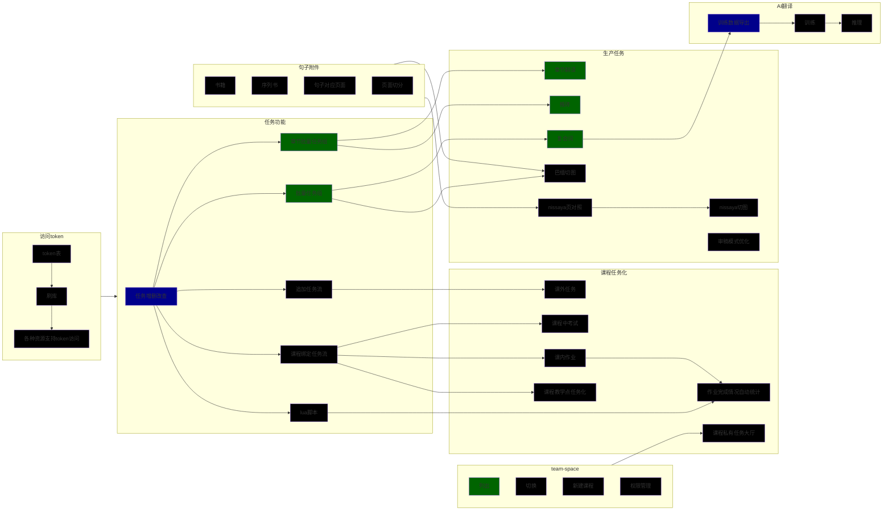

# 2025 开发计划

```mermaid
flowchart LR
classDef done fill:darkgreen;
classDef progressing fill:darkblue;
classDef plan fill:black;

c1[课外任务]:::plan;
c2[课程中考试]:::plan;
c3[课内作业]:::plan;
c4[课程教学点任务化]:::plan;
c5[作业完成情况自动统计]:::plan;
c6[课程私有任务大厅]:::plan;
subgraph c ["课程任务化"]
    c1;
    c2;
    c3;
    c4;
    c5;
    c6;
end

t0[任务增删改查]:::progressing;
t1[章节批量任务组]:::done;
t2[批量任务组]:::done;
t3[课程绑定任务流]:::plan;
t4[lua脚本]:::plan;
t5[追加任务流]:::plan;
subgraph t ["任务功能"]
    t0;
    t1;
    t2;
    t3;
    t4;
    t5;
end

p1[章节翻译]:::done;
p2[搬砖]:::done;
p3[复合词]:::done;
p4[巴缅切图]:::plan;
p5[nissaya页对照]:::plan;
p6[nissaya切图]:::plan;
p7[审稿模式优化]:::plan;
subgraph prod ["生产任务"]
    p1;
    p2;
    p3;
    p4;
    p5;
    p6;
    p7;
end

a1[训练数据导出]:::progressing;
a2[训练]:::plan;
a3[推理]:::plan;
subgraph ai ["AI翻译"]
    a1;
    a2;
    a3;
end

ts1[列出]:::done;
ts2[切换]:::plan;
ts3[新建课程]:::plan;
ts4[权限管理]:::plan;

subgraph tg ["team-space"]
    ts1;
    ts2;
    ts3;
    ts4;
end

sa1[书籍]:::plan;
sa2[序列书]:::plan;
sa3[句子对应页面]:::plan;
sa4[页面切分]:::plan;

subgraph sa ["句子附件"]
    sa1;
    sa2;
    sa3;
    sa4;
end

at1[token表]:::plan;
at2[刷库]:::plan;
at3[各种资源支持token访问]:::plan;
subgraph access_token ["访问token"]
    at1;
    at2;
    at3;
end

t5 --> c1;
t4 --> c5;
t1 --> p1;
t1 --> p2;
t2 --> p3;
p3 --> a1;
a1 --> a2;
a2 --> a3;
t3 --> c2;
t3 --> c3;
t3 --> c4;
tg --> c6;
p5 --> p6;
sa --> p5;
sa --> p4;
t0 --> t1;
t0 --> t2;
t0 --> t3;
t0 --> t4;
t0 --> t5;
c3 --> c5;
t2 --> p4;
access_token --> t;
at1 --> at2;
at2 --> at3;
```
